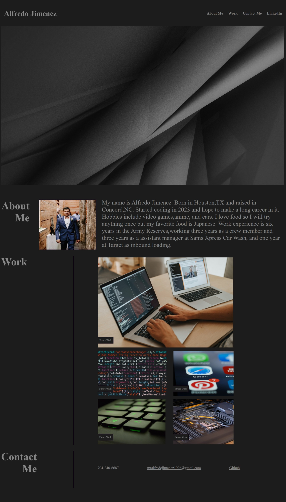

# Alfredo Jimenez's Portfolio

## Description

The purpose of this website is provide future employers a place where they 
can learn about me(Alfredo Jimenez) and also see his past works. It also 
provides contact information if Alfredo needs to be reached. My motivation 
for this project is to have a professional looking website with all my works
that will help me find future jobs. While working on this project I learned 
how to style html using css and how to link images to html.

## Installation

No steps needed to install. Just follow this URL to get to website.
URL: 

## Usage

The website has a simple nav bar on top that will take you to about me, 
work, contact me, and a link to Alfredo's LinkedIn page. The About me 
currently has a small description about Alfredo Jimenez. The work section 
currently just have placeholder images and nothing is linked to them. The 
footer has Alfredo's contact info like phone number, email, and github.

## Image

